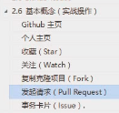
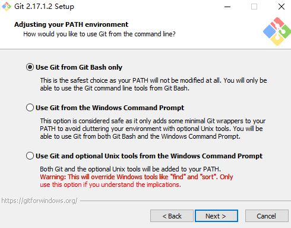
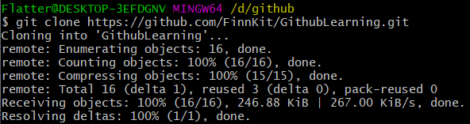
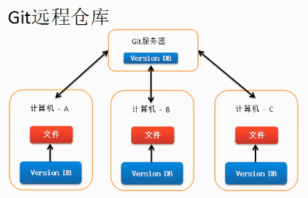
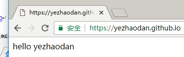

# Git笔记
参考视频：https://www.bilibili.com/video/BV1Xx411m7kn?p=1
参考yezhaodan的github：https://github.com/yezhaodan/-Git

## 基本概念
`Repository` 仓库，用于存放项目代码，每个项目对一个仓库
`Fork` 复制克隆项目，该fork的项目是独立存在的

`Pull request` ：发起合并请求，基于fork
`Watch`：关注项目，可以接收到项目更新提醒
`Issue`：事务卡片，发现代码bug，但目前没有成型代码，需要讨论时可用

> 注意：私有仓库只能自己或者指定的朋友才有权限操作（收费）

## 对文件的操作

- 点击描述可以查看文件提交的详细信息；
- 增加文件：选择`create new file`按钮新建文件；`upload`按钮上传文件；
- 编辑文件：在代码仓库中，点击文件名，进入文件详情页，进行编辑； 
- 删除文件：在代码仓库中，点击文件名，进入文件详情页，进行删除；
- 下载检出文件：在代码仓库中点击`clone or download`按钮

> 注意：删除的文件详细信息可以在`Commits`中查看，`Commits`可以查看每次修改的相关信息；编辑文件也算一次提交

## 对issue的操作

解决`issue`后进行关闭

## 实战操作
这里不做解释，实践出现问题建议返回第五集



## 如何为开源项目做出贡献
**新建issue**

提交使用问题或者建议或者想法

**Pull request**

步骤：
1. 	fork项目
2. 	修改自己仓库的项目代码
3.	新建pull request
4.	等待作者操作（合并）

## Git的安装和使用：
**目的**：使用git管理github托管项目代码

**官方下载网址**[https://git-scm.com/download/win](https://git-scm.com/download/win)

**安装**：注意这里选择第一个；其余傻瓜式安装即可



**检验是否安装成功**：右击鼠标显示`Git GUI Here`和`Git Bash Here`

## Git基本工作流程：新建，修改，删除（本地操作）
### Git工作区域：
1.	Git Repository（Git仓库）最终确定的文件保存到仓库，成为一个新的版本，并对他人可见
2.	暂存区 暂存已经修改的文件最后统一提交到Git仓库中
3.	工作区（Working Directory）添加、编辑、修改文件等动作

### 本地上传Git仓库的流程
所用到的命令可以见后介绍

0. git用户配置
在指定路径下打开git bash，进行用户配置（主要配置用户名与邮箱）

```git
git config --global user.name '这里填写自己的用户名'
git config --global user.email '这里填写自己的用户名邮箱'
git config --list
```

1. 关联远程库：
使用git clone 命令，与github上远程仓库进行关联（实际上也是就是将远程仓库同步到本地上），主要是可以在仓库名的文件夹内存在已经配置过的.git目录。
注意这里采用远程仓库链接为https

	git clone https://github.com/FinnKit/GithubLearning.git


2. 利用git命令对文件进行更新上传到git仓库中：
将更新后的文件或文件夹从工作区中上传到暂存区中（git add xxx），利用git status查看该路径下状态，若上传到暂存区中成功，则显示有new file：xxx；将其上传到git仓库中（git commit -m '提交描述'），查看状态，若成功，则显示相关内容被更改。
这里以一个空的txt文件作为Demo，新建并编辑了test.txt文件

	cd GithubLearning 
	vi test.txt
	git add test.txt
> 注意：这里会出现警告

需要参考 https://blog.csdn.net/qi_sheng_/article/details/107027468 
> 更改Windows配置，避免不同操作系统协作时造成冲突

	git status
	git commit -m 'add a test.txt'


4. 将git仓库上传到远程仓库中
一般网络正常情况下，直接使用`git push https仓库网址`即可。但可能由于网络问题，无法进行上传

> 因此需要参考https://blog.csdn.net/qq_36667170/article/details/79094257
进行github的SSH配置，将本地的服务器的ssh码绑定到github中，利用git push SSH仓库链接进行上传

	git push git@github.com:FinnKit/GithubLearning.git


以上就可利用本地git命令来迭代项目代码了

### 一些Linux的命令
`pwd` ：查看当前路径
`cd` ：进入路径
`ls` ：列写该路径下所有文件
`touch 文件名` ：直接新建一个文件
`vi 文件名` ：新建一个文件，同时进入编辑模式（这里参考https://blog.csdn.net/huang100qi/article/details/80914597 ，注意这里在命令模式下，输入`:x`保存并退出编辑）
`rm -f 文件名` ：强制删除文件
注意：git bush中复制与粘贴的不是ctrl C/V，而是
`Ctrl + insert`  复制
`shift + insert`  粘贴

### 一些需要记住git的命令	
- git status：确定文件当前所处Git工作区域；

这里假设在工作区有文件 `HelloWorld.cpp`
1. 将工作区文件转入暂存区中：

```
git status
git add HelloWorld.cpp；
```

2. 将暂存区文件转入Git 仓库：

```
git status
git commit –m '提交描述'
```
> 是仅接着将工作区文件转入暂存区后的，因此没有文件名
3. 确定文件是否已在Git仓库中：

```
git status
```

4. 删除工作区文件：

```
rm -f 文件名
git rm 文件名
git commit -m '描述'
```
例如：`git rm –f a.txt`

5. 修改文件：
```
vi 文件名
```

例如 `vi a.txt`进入vim修改文件（退出使用：`wq`）

> 如果对vim操作理解有困难的还是建议看一下视频，视频讲了增删改查的相应操作，看一下vim操作指南，对vim操作有全面的认识

### Git基础设置：
初始化基本信息，在桌面上右键，进入git bash（命令行工作模式）
1.	设置用户名

```
git config --global user.name '这里填写自己的用户名'
```

2.	设置用户名邮箱 

```
git config --global user.email '这里填写自己的用户名邮箱'
```

4.  查看是否配置成功

```
git config --list
```

> 注意：该设置是为了在GitHub仓库主页显示谁提交了该文件，注意这里的  - - 数目为2！

### 初始化一个新的Git仓库：

1.	创建文件夹，`mkdir '仓库名称'`（注意文件夹所处的位置，或者在windows下快捷键ctrl+alt+A） 

2.	在文件夹内初始化Git（创建Git 仓库）（注意在文件夹内进行操作）

命令行进入仓库文件夹内，使用 `git init`命令，成功会显示`.git`文件（该文件存储仓库所有数据信息）

3.	向仓库中添加文件

## Git远程仓库
**使用目的**：备份、实现代码共享集中化管理



如何将本地仓库同步到远程仓库中：
**代码传到git仓库，再将其上传到远程仓库中git push**

1.	将远程仓库（github对应的项目）复制到本地：
```
git clone 仓库地址
```

> 注意：主要是为了获取远程仓库地址，仓库地址在clone or download按钮下取得

2.	进行文件增删改查，并工作区转入暂存区，再转入本地的git仓库中
3.	将本地仓库同步到远程仓库中
使用命令：`git push`

> 如果`git push`出现`The requested URL returned error：403 Forbidden while accessing`问题如何解决：

> 为了防止其他人随便同步，在.git文件夹中config文件添加用户名：密码

## Github Page搭建网站
### 个人网站
**访问**

https://用户名.github.io

**搭建步骤**

1.	创建个人站点 -> 新建仓库（注意：仓库名必须是 `用户名.github.io`）
2.	在仓库下新建`index.html`的文件

**测试**

 

> 注意：`github pages`只支持静态网页
>   		 仓库里面只能是`.html`文件

### 项目站点
为了给一个项目增加一个网址说明，可以使用github来设置
**访问**
https://用户名.github.io/仓库名
**搭建步骤**

1.	进入项目主页，点击`settings`
2.	在`settings`页面，点击`[Launch automatic page generator]`来自动生成主题页面
3.	新建站点基础信息设置
4.	选择主题
5.	生成网页

## 利用gitKraken迭代项目代码

详细操作可见https://www.bilibili.com/video/BV1bK4y1t7CD?from=search&seid=2460516559044045181

相关gitKraken6.5.1版本在保存在百度云中

注意在使用旧版本时，需要将Update.exe禁止运行，禁止联网
